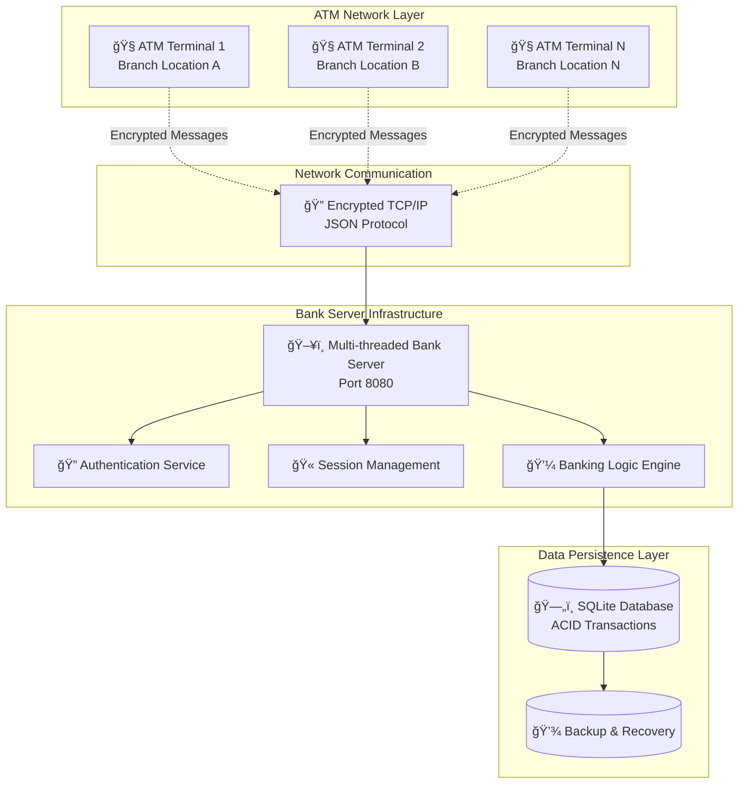
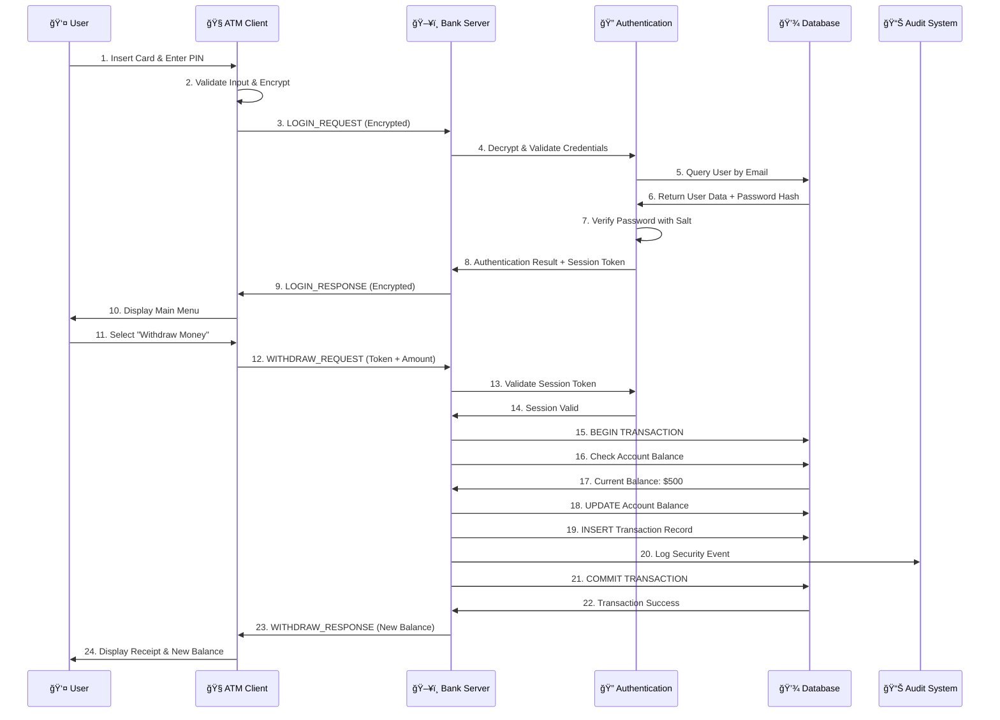

# 🏦 Distributed ATM Banking System

[](https://isocpp.org/)
[](https://sqlite.org/)
[](https://en.wikipedia.org/wiki/Internet_protocol_suite)
[](https://en.wikipedia.org/wiki/Encryption)
[](https://en.wikipedia.org/wiki/Multithreading_(computing))
[](https://github.com)
[](LICENSE)

A **Distributed ATM banking system** built with advanced C++ concepts, demonstrating enterprise-level software engineering practices. This project simulates real-world banking infrastructure with separate ATM machines communicating with a central bank server over encrypted network protocols.

## 🎯 Project Overview

This system demonstrates mastery of:
- **🏗️ Distributed Systems Architecture** - Client-server model with network communication
- **🧵 Multi-threaded Network Programming** - Concurrent ATM handling with thread safety
- **💾 Database Management with ACID Transactions** - SQLite with complete transaction support
- **⚡ Advanced C++ Programming (C++17)** - Modern features, smart pointers, RAII
- **🔐 Cryptography and Security Implementation** - Multi-layer security architecture
- **📈 System Design and Scalability** - Enterprise-ready architecture patterns

## 🎬 Live System Demo

### Terminal Demo: Complete Banking Operations


### **🔐 Security Demo: Encrypted Communication**
```bash
# Network traffic showing encrypted messages
🔒 ATM → Server: "TE9HSU5fUkVRVUVTVHx7ImVtYWlsIjoiam9obkBleGFtcGxlLmNvbSIsInBhc3N3b3JkIjoiUGFzc3dvcmQxMjMhIiwiYXRtX2lkIjoiQVRNLTQ5MTUifQ=="

🔓 Server Decrypts: LOGIN_REQUEST|{"email":"john@example.com","password":"Password123!","atm_id":"ATM-4915"}

🔒 Server → ATM: "TE9HSU5fUkVTUE9OU0V8eyJzdWNjZXNzIjp0cnVlLCJ1c2VyX25hbWUiOiJKb2huIERvZSIsInNlc3Npb25fdG9rZW4iOiJhYmMxMjMifQ=="

🔓 ATM Decrypts: LOGIN_RESPONSE|{"success":true,"user_name":"John Doe","session_token":"abc123"}
```

## 🏗️ System Architecture & Working

### **High-Level Architecture Overview**




### **Application Flow Architecture**


## 🗄️ Database Design & ER Diagrams

### **Complete Entity-Relationship Diagram**


### **Transaction Flow Database Design**

```mermaid
sequenceDiagram
    participant ATM as 🧠ATM Client
    participant Server as ğŸ–¥ï¸ Bank Server
    participant DB as 💾 Database
    participant Audit as 📊 Audit Log

    ATM->>Server: 💸 WITHDRAW_REQUEST
    Server->>DB: 🔠BEGIN TRANSACTION
    Server->>DB: ✅ Validate Account & Balance
    DB-->>Server: 💰 Current Balance: $500

    Server->>DB: 💸 UPDATE Accounts SET balance = balance - 150 WHERE account_id = 6
    Server->>DB: 📠INSERT INTO Transactions (from_account_id, amount, type, status)
    Server->>Audit: 📊 LOG: User 1 withdrew $150 from Account 6

    Server->>DB: ✅ COMMIT TRANSACTION
    DB-->>Server: 💰 New Balance: $350
    Server-->>ATM: ✅ WITHDRAW_RESPONSE: Success, Balance: $350
```



## 🚀 Quick Start & Installation

### **Prerequisites**
- **C++17** compatible compiler (GCC 7+ or Clang 5+)
- **SQLite3** development libraries
- **Make** build system
- **POSIX-compliant OS** (Linux, macOS, Unix)

### **🔧 Installation & Setup**

#### **Step 1: Clone the Repository**
```bash
git clone https://github.com/AbhimanyuIITGN/Banking_Management.git
cd Banking_Management
```

#### **Step 2: Build the Bank Server**
```bash
# Clean and build the main banking system
make clean && make all

# Verify build success
ls -la bin/
# Should show: banking_system, bank_server
```

#### **Step 3: Build the ATM Client**
```bash
# Navigate to ATM directory and build
cd ATM_Machine
make clean && make all
cd ..

# Verify ATM build
ls -la ATM_Machine/bin/
# Should show: atm_client
```

#### **Step 4: Initialize the Database**
```bash
# Create initial database and users
./bin/banking_system

# Follow the interactive prompts:
# 1. Create admin user
# 2. Create test users (john@example.com, jane@example.com)
# 3. Create accounts with initial balances
```

### **🎮 Running the Complete System**

#### **Terminal 1: Start Bank Server**
```bash
./bin/bank_server
# Output:
# === Banking System Server ===
# ✅ Database connected: banking_system.db
# 🚀 Bank Server started on port 8080
# ⏳ Waiting for ATM connections...
```

#### **Terminal 2: Start ATM Client 1**
```bash
cd ATM_Machine
./bin/atm_client
# Follow login prompts and perform operations
```

#### **Terminal 3: Start ATM Client 2 (Concurrent Testing)**
```bash
cd ATM_Machine
./bin/atm_client
# Test concurrent operations with different user
```

## 🔧 Technical Features

### Core Banking System
-  **User Management**: Registration, authentication, profile management
-  **Account Operations**: Multiple account types (Savings, Checking)
-  **Transaction Processing**: Deposits, withdrawals, transfers, balance inquiries
-  **Transaction History**: Complete audit trail with timestamps
-  **Multi-user Support**: Concurrent user sessions

### Advanced Programming Concepts
-  **Object-Oriented Design**: Inheritance, polymorphism, encapsulation
-  **Design Patterns**: Singleton, Factory, Observer, Strategy
-  **Memory Management**: Smart pointers, RAII, exception safety
-  **Concurrency**: Multi-threading, mutex synchronization, deadlock prevention
-  **Template Programming**: Generic containers and type safety

### Network & Security
-  **TCP/IP Sockets**: Reliable client-server communication
-  **Custom Protocol**: JSON-based messaging with encryption
-  **Session Management**: Token-based authentication
-  **Encryption**: XOR cipher with Base64 encoding
-  **Security**: Password hashing, input validation, SQL injection prevention

### Database Management
-  **SQLite Integration**: Embedded database with full SQL support
-  **ACID Transactions**: Atomic, consistent, isolated, durable operations
-  **Prepared Statements**: Performance optimization and security
-  **Database Schema**: Normalized design with proper relationships
-  **Concurrent Access**: Thread-safe database operations


## 📚 Documentation
- **[System Guide](DISTRIBUTED_SYSTEM_GUIDE.md)** - Setup and usage instructions

## 🔄 System Working & Data Flow

### **Complete Transaction Processing Flow**




### **Security & Encryption Flow**

```mermaid
flowchart LR
    subgraph "ATM Side"
        Input[👤 User Input]
        Validate[✅ Input Validation]
        Encrypt[🔠XOR + Base64 Encrypt]
        Send[📤 Send via TCP]
    end

    subgraph "Network"
        TCP[🌠TCP/IP Socket<br/>Encrypted Channel]
    end

    subgraph "Server Side"
        Receive[📥 Receive Message]
        Decrypt[🔓 Base64 + XOR Decrypt]
        Process[âš™ï¸ Process Request]
        Response[📠Create Response]
        EncryptResp[🔠Encrypt Response]
        SendResp[📤 Send Response]
    end

    Input --> Validate
    Validate --> Encrypt
    Encrypt --> Send
    Send --> TCP
    TCP --> Receive
    Receive --> Decrypt
    Decrypt --> Process
    Process --> Response
    Response --> EncryptResp
    EncryptResp --> SendResp
    SendResp --> TCP
```




##  Authors

**Dipesh Patidar**
- 📧 Email: dipesh.patidar@iitgn.ac.in

**Abhimanyu Yadav**
- 📧 Email: abhimanyu.abhimanyu@iitgn.ac.in

---

⭐ **Star this repository if you found it helpful for your learning journey!** ⭐
